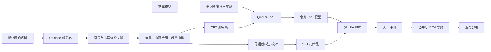

# 范围与总体架构

## 1. 语言范围

项目默认目标是诺苏语（Nuosu），即四川凉山地区使用的规范彝文。项目内部语言标签统一使用：

```yaml
language_name_zh: 诺苏语
language_name_en: Nuosu
iso_639_1: ii
iso_639_3: iii
script: Yi
orthography: standardized_liangshan_yi
```

语料采集、方言治理、清洗和数据版本化由相邻的 `nuosu-corpus` 仓库负责；本仓库只读取其
`data/processed` 产物进行训练和评测。

以下数据必须单独标注，不能直接混入默认语料：

- 云南、贵州等地区的其他彝语支系；
- 传统彝文、古彝文及非规范字形；
- 拉丁转写；
- OCR 未校正文本；
- 机器翻译但未经母语者核验的数据。

数据源中的 `yi` 常表示意第绪语（Yiddish）。采集程序应根据 `ii` / `iii`、Unicode 字符范围和人工抽样共同判断，不能只相信语言标签。

## 2. 产品目标

第一阶段支持：

- 规范彝文输入识别；
- 诺苏语日常问答；
- 彝汉双向翻译；
- 诺苏语摘要、改写和纠错；
- 对授权知识库进行检索增强问答。

第一阶段不承诺：

- 所有彝语支系相互转换；
- 医疗、法律等高风险领域的自动决策；
- 无人工复核的文化、历史结论；
- 用生成模型替代母语教师、翻译人员或社区代表。

## 3. 为什么不从零训练

小型模型从零训练仍需要大量、多样且高质量的 token。诺苏语公开语料有限，从零训练容易得到语言能力和通用推理能力都不足的模型。

本项目复用已有基础模型的中文、英文和通用知识能力，只对以下部分做增量适配：

1. **分词审计**：确认基础模型能有效编码规范彝文；
2. **CPT**：用纯诺苏语和彝汉混合语料学习语言分布；
3. **SFT**：学习问答、翻译、摘要等交互格式；
4. **量化部署**：把合并模型转换为 INT4 / GGUF。

## 4. 训练流程



## 5. 模型选择

研究型 CPT 默认使用经过实际 SHA-256 校验的本地 `Qwen/Qwen3-8B-Base`，原因是：

- 模型容量比 1.7B 更适合承担翻译、问答和多轮对话；
- 单张 24GB GPU 仍可使用 QLoRA 训练；
- 中文基础较好，方便彝汉迁移；
- Apache-2.0 许可便于研究和部署；
- Qwen3 纯文本工具链和量化支持相对成熟。

低资源 SFT 应先建立 `Qwen/Qwen3-8B` 对话版基线，再判断是否需要 Base+CPT 路线。候选模型
必须先通过模型文件校验、通用生成冒烟、同一批真实诺苏语句子的分词审计和零样本评测。
模型官方宣称的“多语言支持”不能替代诺苏语专项验证。

## 6. 何时需要扩充词表

只有同时满足以下情况，才建议进入词表扩充实验：

- 每个规范彝文字符平均被拆为明显过多 token；
- 出现 `<unk>` 或稳定乱码；
- CPT 后语言建模指标仍无实质改善；
- 已有足够语料训练新增 embedding；
- 可以承担合并、量化和推理工具兼容性测试。

词表扩充后，必须训练新增 embedding 和 LM head，普通 `all-linear` LoRA 不足以覆盖这些参数。
